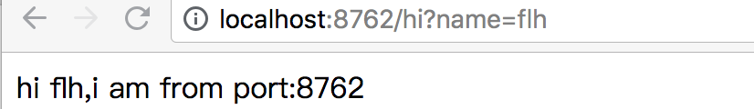
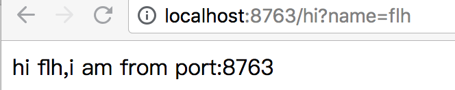
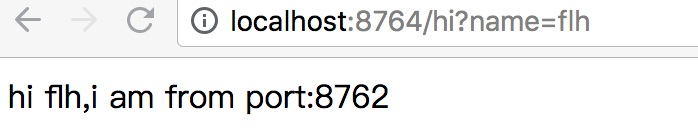

# spring_cloud_learning
#关于spring cloud和actuator的学习
###组员；陈江涛 方娄昊 刘泽宇 贾兴国 李琥

一.Spring Cloud简介 
**Spring Cloud是一系列框架的有序集合。它可以很好地和Spring Boot结合，利用Spring Boot的开发便利性巧妙地简化了分布式系统基础设施的开发，如服务发现注册、配置中心、消息总线、负载均衡、断路器、数据监控等，都可以用Spring Boot的开发风格做到一键启动和部署。**
***

二.服务的注册与发现（Eureka） 
**1.创建一个maven工程，然后创建两个model工程，分别为Eureka Server和Eureka Client。**  
**2.通过注解@EnableEurekaServer启动一个服务注册中心，修改配置文件application.yaml指定这个server。**  
以下为eureka server界面(没有注册服务时显示为 No instances available)
 
**3.通过注解@EnableEurekaClient创建一个服务提供者eureka client。当lient向server注册时，它会提供一些元数据，例如主机和端口，URL，主页等。Eureka server 从每个client实例接收心跳消息。 如果心跳超时，则通常将该实例从注册server中删除。**  
**4.修改Eureka Client配置文件application.yaml注明服务注册中心**  
**5.启动工程，打开http://localhost:8761 ，即eureka server 的网址：** 

***

三.服务消费者（rest+ribbon） 
**1.ribbon简介：ribbon是一个负载均衡客户端，Ribbon客户端组件提供一系列完善的配置项如连接超时，重试等。简单的说，就是在配置文件中列出Load Balancer后面所有的机器，Ribbon会自动的帮助你基于某种规则（如简单轮询，随即连接等）去连接这些机器。我们也很容易使用Ribbon实现自定义的负载均衡算法。**  
**2.启动eureka-server工程；启动service-hi工程，它的端口为8762；将service-hi的配置文件的端口改为8763,并启动，这时你会发现：service-hi在eureka-server注册了2个实例，这就相当于一个小的集群。**  
**3.新建一个服务消费者，在它的pom.xml文件分别引入起步依赖spring-cloud-starter-eureka、spring-cloud-starter-ribbon、spring-boot-starter-web，在工程的配置文件指定服务的注册中心地址为http://localhost:8761/eureka/，程序名称为 service-ribbon，程序端口为8764**  
**4.在工程的启动类中,通过@EnableDiscoveryClient向服务中心注册；并且向程序的ioc注入一个bean: restTemplate;并通过@LoadBalanced注解表明这个restRemplate开启负载均衡的功能。**  
**5.写一个测试类HelloService，通过之前注入ioc容器的restTemplate来消费service-hi服务的“/hi”接口，再一个controller，在controller中用调用HelloService 的方法**  
**6.在浏览器上多次访问http://localhost:8764/hi?name=flh，浏览器交替显示**  
 

***
