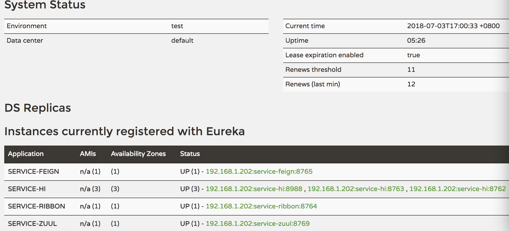

#关于spring cloud和actuator的学习
###组员；陈江涛 方娄昊 刘泽宇 贾兴国 李琥

一.actuator与Spring Cloud简介 
**1.Spring Boot Actuator完全是一个用于暴露自身信息的模块，所以很明显，它的主要作用是用于监控与管理。**  
**新建一个Spring Boot项目，依赖注入并修改application.yaml文件** 
 
 
**在浏览器上访问http://localhost:8777//actuator/health**,浏览器显示如下： 
 

**2.Spring Cloud是一系列框架的有序集合。它可以很好地和Spring Boot结合，利用Spring Boot的开发便利性巧妙地简化了分布式系统基础设施的开发，如服务发现注册、配置中心、消息总线、负载均衡、断路器、数据监控等，都可以用Spring Boot的开发风格做到一键启动和部署。**
***

二.服务的注册与发现（Eureka） 
**1.创建一个maven工程，然后创建两个model工程，分别为Eureka Server和Eureka Client。**  
**2.通过注解@EnableEurekaServer启动一个服务注册中心，修改配置文件application.yaml指定这个server。**  
以下为eureka server界面(没有注册服务时显示为 No instances available)
 
**3.通过注解@EnableEurekaClient创建一个服务提供者eureka client。当lient向server注册时，它会提供一些元数据，例如主机和端口，URL，主页等。Eureka server 从每个client实例接收心跳消息。 如果心跳超时，则通常将该实例从注册server中删除。**  
**4.修改Eureka Client配置文件application.yaml注明服务注册中心**  
**5.启动工程，打开http://localhost:8761 ，即eureka server 的网址：** 

***

三.服务消费者（rest+ribbon） 
**1.ribbon简介：ribbon是一个负载均衡客户端，Ribbon客户端组件提供一系列完善的配置项如连接超时，重试等。简单的说，就是在配置文件中列出Load Balancer后面所有的机器，Ribbon会自动的帮助你基于某种规则（如简单轮询，随即连接等）去连接这些机器。我们也很容易使用Ribbon实现自定义的负载均衡算法。**  
**2.启动eureka-server工程；启动service-hi工程，它的端口为8762；将service-hi的配置文件的端口改为8763,并启动，这时你会发现：service-hi在eureka-server注册了2个实例，这就相当于一个小的集群。**  
**3.新建一个服务消费者，在它的pom.xml文件分别引入起步依赖spring-cloud-starter-eureka、spring-cloud-starter-ribbon、spring-boot-starter-web，在工程的配置文件指定服务的注册中心地址为http://localhost:8761/eureka/，程序名称为 service-ribbon，程序端口为8764**  
**4.在工程的启动类中,通过@EnableDiscoveryClient向服务中心注册；并且向程序的ioc注入一个bean: restTemplate;并通过@LoadBalanced注解表明这个restRemplate开启负载均衡的功能。**  
**5.写一个测试类HelloService，通过之前注入ioc容器的restTemplate来消费service-hi服务的“/hi”接口，再一个controller，在controller中用调用HelloService 的方法**  
**6.在浏览器上多次访问http://localhost:8764/hi?name=flh，浏览器交替显示**  
 

***

四.服务消费者（Feign） 
**1.Feign简介:Feign是一个声明式的伪Http客户端，它使得写Http客户端变得更简单。使用Feign，只需要创建一个接口并注解。它具有可插拔的注解特性，可使用Feign 注解和JAX-RS注解。Feign支持可插拔的编码器和解码器。Feign默认集成了Ribbon，并和Eureka结合，默认实现了负载均衡的效果。**  
**2.新建一个feign服务，在它的pom文件引入Feign的起步依赖spring-cloud-starter-feign、Eureka的起步依赖spring-cloud-starter-eureka、Web的起步依赖spring-boot-starter-web，在工程的配置文件指定程序名为service-feign，端口号为8765，服务注册地址为http://localhost:8761/eureka/**  
**3.在程序的启动类ServiceFeignApplication 加上@EnableFeignClients注解开启Feign的功能。定义一个feign接口，通过@FeignClient（“服务名”）来指定调用哪个服务。在Web层的controller层，对外暴露一个”/hi”的API接口，通过上面定义的Feign客户端SchedualServiceHi来消费服务。**  
**4.启动程序，多次访问http://localhost:8765/hi?name=flh,浏览器交替显示：**  
 

***

五.断路器（Hystrix） 
**1.在微服务架构中，根据业务来拆分成一个个的服务，服务与服务之间可以相互调用（RPC），在Spring Cloud可以用RestTemplate+Ribbon和Feign来调用。为了保证其高可用，单个服务通常会集群部署。由于网络原因或者自身的原因，服务并不能保证100%可用，如果单个服务出现问题，调用这个服务就会出现线程阻塞，此时若有大量的请求涌入，Servlet容器的线程资源会被消耗完毕，导致服务瘫痪。服务与服务之间的依赖性，故障会传播，会对整个微服务系统造成灾难性的严重后果，这就是服务故障的“雪崩”效应。
为了解决这个问题，业界提出了断路器模型。**  
**Netflix开源了Hystrix组件，实现了断路器模式，SpringCloud对这一组件进行了整合。**

 
**较底层的服务如果出现故障，会导致连锁故障。当对特定的服务的调用的不可用达到一个阀值（Hystric 是5秒20次） 断路器将会被打开。**

**断路打开后，可用避免连锁故障，fallback方法可以直接返回一个固定值。**
  
**2.在ribbon使用断路器** 
**1）改造serice-ribbon 工程的代码，首先在pox.xml文件中加入spring-cloud-starter-hystrix的起步依赖：** 
**2）在程序的启动类ServiceRibbonApplication 加@EnableHystrix注解开启Hystrix** 
**3）改造HelloService类，在hiService方法上加上@HystrixCommand注解。该注解对该方法创建了熔断器的功能，并指定了fallbackMethod熔断方法，熔断方法直接返回了一个字符串，字符串为”hi,”+name+”,sorry,error!”**  
**启动：service-ribbon 工程，当我们访问http://localhost:8764/hi?name=flh,浏览器显示**
 
**此时关闭 service-hi 工程，当我们再访问http://localhost:8764/hi?name=flh，浏览器会显示**
 
**3.Feign中使用断路器** 
**1）Feign是自带断路器的，在D版本的Spring Cloud中，它没有默认打开。需要在配置文件中配置打开它。** 
**2）基于service-feign工程进行改造，在FeignClient的SchedualServiceHi接口的注解中加上fallback的指定类** 
**3）SchedualServiceHiHystric需要实现SchedualServiceHi 接口，并注入到Ioc容器中** 
**4）启动servcie-feign工程，浏览器打开http://localhost:8765/hi?name=flh,注意此时service-hi工程没有启动，网页显示** 
 
**5）打开service-hi工程，再次访问，浏览器显示** 
 
***

六.路由网关(zuul) 
**1.Zuul简介：Zuul的主要功能是路由转发和过滤器。路由功能是微服务的一部分，比如／api/user转发到到user服务，/api/shop转发到到shop服务。zuul默认和Ribbon结合实现了负载均衡的功能。**  
**2.创建service-zuul工程，在其入口applicaton类加上注解@EnableZuulProxy，开启zuul的功能**  
**3.修改配置文件application.yaml，指定服务注册中心的地址为http://localhost:8761/eureka/，服务的端口为8769，服务名为service-zuul；以/api-a/ 开头的请求都转发给service-ribbon服务；以/api-b/开头的请求都转发给service-feign服务**  
**4.新建MyFilter类，重写fileerType，filterOrder，shouldFilter，run，做安全验证。**  
**5.依次运行这五个工程;打开浏览器访问：http://localhost:8769/api-a/hi?name=flh;浏览器显示**
  
**6.访问 http://localhost:8769/api-a/hi?name=flh&token=22 ； 
网页显示**
  
***

七.服务链路追踪(Spring Cloud Sleuth) 
**1.Spring Cloud Sleuth简介：Spring Cloud Sleuth 主要功能就是在分布式系统中提供追踪解决方案，并且兼容支持了zipkin，你只需要在pom文件中引入相应的依赖即可。**  
**2.下载并使用zipkin**  
  
  
  
  
  
  
**3.构建server-zipkin,在其pom引入依赖,在其程序入口类, 加上注解@EnableZipkinServer，开启ZipkinServer的功能,在配置文件application.yml指定服务端口为9411。**  
**4.创建service-hi,在其pom引入起步依赖spring-cloud-starter-zipkin,在其配置文件application.yml指定zipkin server的地址，通过配置“spring.zipkin.base-url”指定: server.port=8988 
spring.zipkin.base-url=http://localhost:9411 
spring.application.name=service-hi 
并且对外暴露hi接口**  

**5.创建service-miya,创建过程同service-hi，引入相同的依赖，配置下spring.zipkin.base-url。对外暴露miya接口，这两个service可以相互调用；并且只有调用了，server-zipkin才会收集数据的，这就是为什么叫服务追踪了。**  
**6.依次启动上面的三个工程，打开浏览器访问：http://localhost:9411/，再访问http://localhost:8989/miya，再打开http://localhost:9411/获取追踪信息** 
**点击find traces,就可以看到具体服务相互调用的数据了**  
  

